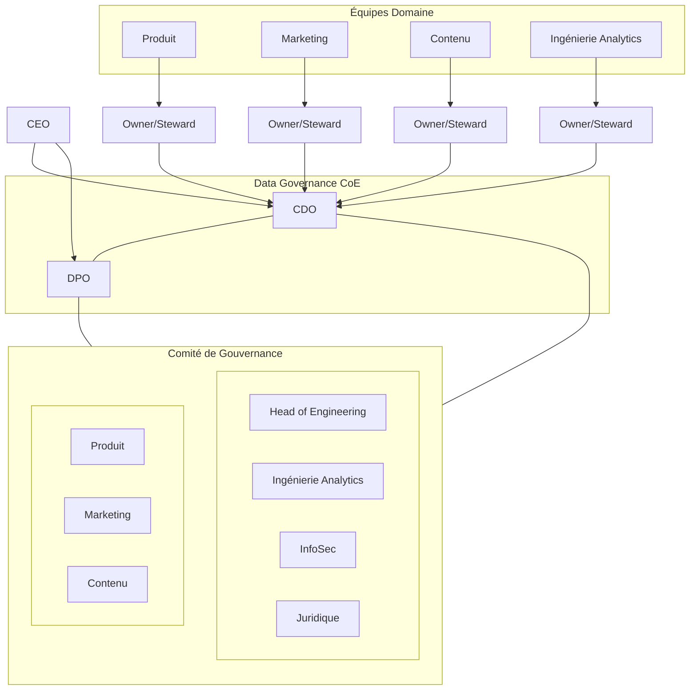

# Rôles & Responsabilités — Gouvernance des Données Spotify

## 1. Rôles clés
- DPO (Délégué à la Protection des Données)
  - Pilote la stratégie privacy et la conformité (RGPD, CCPA, overlays régionaux).
  - Tient le ROPA, supervise DSR, brèches (72 h), et DPIA.
  - Forme les équipes et est l’interface avec les autorités.
- CDO (Chief Data Officer)
  - Porte le modèle opératoire, la politique et le programme qualité.
  - Anime la culture data ; copréside le comité de gouvernance.
- Head of Engineering
  - Plateformes sécurisées/évolutives ; catalogue, linéage, intégration, qualité.
  - RBAC/ABAC, chiffrement, séparation env., monitoring/audits.
- Juridique
  - Interprétation des textes ; revue des politiques, DPIA et contrats ; veille.
- Product Managers
  - Privacy‑by‑design ; conformité des features ; DPIA si besoin.
  - Définissent contrats de données et rétention côté produit.
- Data Owners (par domaine)
  - Responsables de la qualité, accès, rétention ; valident changements de schéma/contrat ; maintiennent le catalogue.
- Data Stewards (par domaine)
  - Opèrent contrôles qualité, linéage, classifications, remédiations ; veillent au respect du consentement.
- InfoSec
  - Standards sécurité ; revues d’accès ; réponse à incident.
- Leads Analytics (Marketing, Contenu, Ingénierie)
  - Définissent CDEs ; suivent SLAs de qualité et accès gouverné.

## 2. Matrice RACI
| Activité | DPO | CDO | Ingé | Juridique | Produit | Leads Analytics | Owner | Steward | InfoSec |
|---|---|---|---|---|---|---|---|---|---|
| Politique de gouvernance | C | A | C | C | C | C | R | R | C |
| Catalogue & Linéage | C | A | R | C | C | C | R | R | C |
| CDEs & SLAs qualité | C | A | C | C | C | R | A | R | C |
| Consentement & DSR | A | C | C | C | C | C | R | R | C |
| DPIA nouvelles features | A | C | C | R | R | C | C | C | C |
| Contrôle d’accès (RBAC/ABAC) | C | C | A | C | C | R | R | R | A |
| Incident/Brèche | A | C | R | R | C | C | C | C | A |
| Rétention & Suppression | C | C | C | C | C | C | A | R | C |
| Notices & ROPA | A | C | C | R | C | C | C | C | C |
| CMP & GPC (gestion du consentement) | A | C | C | C | R | C | C | C | C |
| Portail DSR & SLA | A | C | R | C | C | C | C | C | C |
| Drill brèche 72 h | A | C | C | C | C | C | C | C | R |
| Politique SSI (PCI‑DSS) | C | C | C | C | C | C | C | C | A |
| Opt‑out CCPA & non‑discrimination | C | C | C | R | A | C | C | C | C |

Légende: A = Accountable, R = Responsible, C = Consulted.

## 3. Cadence opératoire
- Comité CoE mensuel ; revue exécutif trimestrielle (KPIs, risques, roadmap).
- Revue qualité mensuelle par domaine ; revues d’accès trimestrielles (InfoSec).
- Drills brèche 72 h: trimestriels (coordination DPO/InfoSec).
- Revue DSR mensuelle (respect SLA, causes racines, remédiations).
- Mise à jour annuelle de la politique (ou changement réglementaire/technologique).

## 5. Notes d’alignement (tableau conformité 4.6)
- DPO/Juridique: Notices & ROPA (60 j), désignation DPO (14 j).
- Produit/Marketing/Juridique: CMP & GPC (45 j), Opt‑out CCPA (30 j).
- DPO/Ingénierie: Portail DSR & SLA (60 j), accès/suppression CCPA (45 j).
- InfoSec/DPO: Runbook et drill brèche 72 h (30 j, puis trimestriel).
- InfoSec/RH: Politique SSI (30 j) et formation 100% personnel.

## 4. Organigramme (Mermaid)

Notes:
- Chaque domaine nomme un Owner (A) et un Steward (R) consignés dans le catalogue.
- Le comité résout les sujets inter-domaines, fixe les standards et suit les KPIs.
- Les colonnes du RACI représentent des fonctions (DPO, CDO, Ingé, Juridique, Produit, Leads Analytics, Owners/Stewards, InfoSec). « Contenu » est un domaine (avec Owner/Steward) et n’apparaît donc pas comme colonne RACI.
