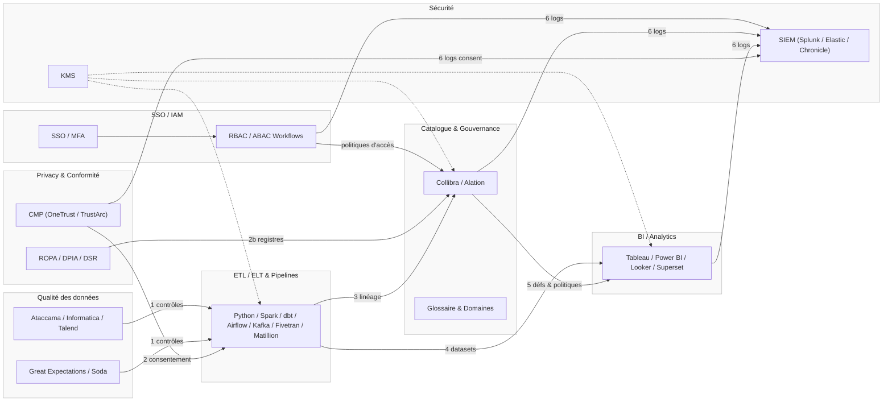

# Plan de Mise en Œuvre — Gouvernance des Données Spotify (Étape 3)

Objectif : livrer un plan 60–90 jours pour opérationnaliser la gouvernance, améliorer la qualité des CDEs et activer un self‑service sûr, via un pilote inter‑domaines.

## Résumé exécutif (pour décision CEO)
- Pourquoi maintenant: accélérer le time‑to‑insight et réduire les risques (amendes, incidents, rework) en normalisant la qualité, la confidentialité et l’accès aux données.
- Ce que l’on obtient en 90 jours: un pilote inter‑domaines avec catalogue, contrôles qualité sur CDEs, gestion du consentement/DSR, RBAC/ABAC, drill brèche 72 h, et KPIs de suivi.
- Valeur attendue: décisions plus rapides (datasets de référence + couche sémantique), confiance accrue (qualité mesurée), conformité prouvable (tableau 4.6), réduction des coûts de rework et d’audit.
- Approche: « minimum viable governance » — outillage pragmatique, adossement à l’existant, alternatives OSS possibles; montée en charge graduelle après validation du pilote.

---

## 1) Modèle et cadence
Modèle recommandé : Centre d’Excellence (CoE)
- Pourquoi : équilibre vitesse/consistance à l’échelle globale ; standards centraux + Owners/Stewards dans les domaines.
- Composition : Comité (DPO, CDO, Head of Engineering, Ingénierie Analytics, InfoSec, Juridique, Produit, Marketing, Contenu) ; Owners/Stewards par domaine.
- Cadence : comité mensuel, revue exécutive trimestrielle ; revues qualité mensuelles ; revues d’accès trimestrielles.
- Livrables : playbook, RACI, ownership dans le catalogue, cartographie politique→contrôles.

---

## 2) Outillage (recommandations et explications)
Critères généraux
- Métier: prouver la conformité, fiabiliser les KPIs, accélérer les décisions, réduire le rework; UX simple pour non‑tech.
- Technique: échelle, couverture multi‑réglementaire, APIs/linéage, SSO/IAM, automatisation, intégration cloud; TCO maîtrisé.

IAM / SSO — Gestion des identités, MFA, groupes, RBAC/ABAC
- Rôle (non‑tech): garantir que seules les bonnes personnes accèdent aux bonnes données, avec une UX fluide (SSO/MFA).
- Rôle (tech): fédération d’identités, groupes/attributs, provisioning, MFA; expose RBAC/ABAC aux plateformes et au catalogue.
- Outils: Okta, Azure AD (Entra ID), Auth0; LDAP/SCIM pour provisioning.
- Intégrations clés: catalogue (workflows d’accès), BI, pipelines, SIEM (journaux), privacy (identité pour DSR).
- Risques si absent: accès ad hoc, revues d’accès pénibles, non‑conformité PCI‑DSS/SSI.

Catalogue & Gouvernance — Collibra / Alation (OSS: Apache Atlas, OpenMetadata)
- Rôle (non‑tech): « carte des données » et point unique de vérité: qui possède quoi, à quoi ça sert, quelles règles s’appliquent, comment on y accède.
- Rôle (tech): métamodèle, glossaire, domaines, data contracts, workflow d’accès (RBAC/ABAC), intégrations linéage; référentiel d’owners/stewards.
- Pourquoi: sans catalogue, les équipes cherchent, doublonnent et réinventent; avec, on partage les mêmes définitions/KPIs et on trace les responsabilités.
- Intégrations clés: pipelines (ETL/ELT), BI, IAM (SSO, groupes), privacy (ROPA/consent), qualité (règles/scorecards).
- Alternatives: Alation (fort sur la découverte), Atlas/OpenMetadata (OSS) si contrainte budget; choisir selon intégrations natives, gouvernance des workflows et maturité interne.
- Risques si absent: qualité non auditable, accès ad hoc, définitions incohérentes.

Qualité des données — Ataccama ONE / Informatica DQ / Talend (OSS: Great Expectations, Soda)
- Rôle (non‑tech): rendre visibles et corrigeables les problèmes qui sapent la confiance (fraîcheur, complétude, anomalies) sur les CDEs.
- Rôle (tech): profiling, règles sur schéma/valeurs, détection d’anomalies, alerting, SLAs, scorecards, hooks de remédiation.
- Pourquoi: les recos et reportings s’appuient sur quelques champs critiques; les contrôler systématiquement évite les décisions biaisées et le rework.
- Intégrations clés: catalogue (déclare les règles par CDE et affiche les scorecards), pipelines (exécution des contrôles), observabilité.
- Alternatives: Great Expectations/Soda pour un MVP orienté code; Informatica/Talend pour suites intégrées; retenir selon compétences internes et couverture cloud.
- Risques si absent: incidents invisibles, « data ping‑pong » entre équipes, perte de confiance.

Privacy & Conformité — OneTrust / TrustArc (MVP: portail DSR + tableurs ROPA)
- Rôle (non‑tech): prouver la conformité RGPD/CCPA (consentement, DSR, ROPA, DPIA) avec des workflows traçables.
- Rôle (tech): registres (ROPA), centre de préférences (CMP + GPC), portail DSR, modèles DPIA, preuves/rapports d’audit.
- Pourquoi: transformer des obligations réglementaires en opérations mesurables; sécurise l’expansion produit et réduit le risque d’amende.
- Intégrations clés: web/app (CMP), marketing (synchro préférences), catalogue (cartographie traitements→datasets), IAM (identité pour DSR).
- Alternatives: MVP interne (portail simple + tickets + tableurs) pour démarrer, mais industrialisation recommandée au‑delà du pilote.
- Risques si absent: incapacité à démontrer la conformité (tableau 4.6), délais DSR non tenus, exposition légale.

Sécurité & Monitoring — Splunk (SIEM) + KMS (Vormetric ou cloud‑native)
- Rôle (non‑tech): détecter/réagir vite aux incidents et protéger les données sensibles (chiffrement, clés, accès sous contrôle).
- Rôle (tech): ingestion journaux, corrélation/alertes, runbooks; chiffrement au repos/en transit; séparation des rôles KMS; support PCI‑DSS.
- Pourquoi: shorten MTTD/MTTR et fournir les preuves d’audit; nécessaire pour le drill brèche 72 h et les revues d’accès trimestrielles.
- Intégrations clés: sources cloud/data, IAM (MFA, groupes), DLP/EDR, catalogue (politiques d’accès), privacy (journaux DSR/consent).
- Alternatives: Elastic/Chronicle pour SIEM; KMS cloud (AWS KMS, GCP KMS, Azure Key Vault) si already‑there; choisir selon stack existante.
- Risques si absent: détection tardive, non‑conformité PCI‑DSS/SSI, exposition accrue.

ETL / ELT & Pipelines — Ingestion/transformations, orchestration, contrats
- Rôle (non‑tech): produire des jeux de données fiables et traçables au bon rythme, intégrer consentement/rétention.
- Rôle (tech): jobs Python/PySpark, orchestrations Airflow, transformations dbt, flux Kafka; connecteurs ELT (Fivetran, Stitch, Matillion).
- Intégrations clés: qualité (exécution des contrôles), catalogue (linéage/métadonnées), privacy (propagation consentement), BI (publication datasets).
- Alternatives: cloud‑native (Glue, Dataflow, Data Fusion) selon stack.
- Risques si absent: dette technique, flux opaques, linéage lacunaire, propagation incomplète du consentement.

BI / Analytics — Consommation gouvernée et standardisée
- Rôle (non‑tech): rendre les KPIs et analyses accessibles, sourcées, et alignées.
- Rôle (tech): sémantique commune, politiques appliquées, exposition gouvernée.
- Outils: Tableau, Power BI, Looker, Superset; notebooks (Jupyter) pour exploratoire.
- Intégrations clés: catalogue (définitions & politiques), IAM (RBAC/ABAC), SIEM (journaux), KMS (chiffrement).
- Risques si absent: définitions divergentes, shadow BI, difficulté à prouver la conformité.

Intégrations transverses (comment ça s’assemble)
- IAM/Accès: RBAC/ABAC pilotés par le catalogue; revues périodiques via InfoSec.
- Linéage: collecté des pipelines/outils; visible dans le catalogue; utilisé pour DSR/DPIA.
- Contrats de données: versionnés et gérés dans le catalogue; promotion (brut→curé→analytique) sous contrôle; contrôles qualité branchés aux points de promotion.

### Schéma d’ensemble (Mermaid)

---

## 3) Déploiement 60–90 jours (phases)
Phase 0 (Sem. 0–2) Mobilisation & baseline
- Mettre en place le CoE ; confirmer rôles (Owners/Stewards) ; publier RACI.
- Démarrer la sélection/procurement des outils ; fallback léger si besoin (Atlas + tableurs).
- Concevoir le socle de conformité : notices/ROPA, consentement (CMP/GPC), DSR (portail + SLA), DPIA, brèche 72 h ; aligné sur la politique.
- Définir les CDEs du pilote : recos, métadonnées contenu, abonnements, marketing.

Phase 1 (Sem. 2–6) Fondations pour le pilote
- Catalogue : charger domaines du pilote ; ownership, glossaire, classifications, linéage initial ; workflow d’accès.
- Qualité : contrôles sur CDEs (schéma, complétude, fraîcheur), alertes et SLAs ; scorecards publiées.
- Conformité : notices/ROPA complets; pipeline de consentement (CMP) avec GPC; workflow DSR avec SLA; intake DPIA; planifier un exercice de brèche.
- Accès & sécurité : principe du moindre privilège (accès minimal nécessaire) via RBAC/ABAC, chiffrement, démarrer les revues d’accès.

Phase 2 (Sem. 6–10) Pilote & durcissement
- Dataset pilote : inter‑domaines gouverné et « consent‑aware » (écoutes + marketing) ; contrats standardisés ; SLO de fraîcheur ; auto‑rafraîchissement.
- BI/couche sémantique : 3–5 KPIs standardisés publiés.
- Drill & validation : exercice brèche 72 h ; test end‑to‑end DSR (accès/suppression) ; vérification opt‑out CCPA ; remédiations.
- Adoption : 2–3 consommateurs prioritaires onboardés ; feedback.

Phase 3 (Sem. 10–12) Revue & montée en charge
- Lecture des KPIs ; REX ; plan de scale vers d’autres domaines.
- Étendre couverture contrats/linéage ; affiner règles qualité ; étendre consentement si besoin.

---

## 4) Pilote (périmètre & équipe)
- Périmètre : Produit (écoutes/session) + Marketing (campagne/engagement) + métadonnées + abonnements.
- Équipe : PM pilote (CoE), DPO, CDO, Ingénierie, Juridique, Owners/Stewards, InfoSec.
- Livrables : entrées de catalogue, linéage, scorecards, logs consentement, DSR/DPIA/ROPA, dataset pilote, dashboard KPIs.

---

## 5) Dépendances & risques
- Dépendances : IAM, intégration pipelines/linéage, identifiants marketing/produit, délais procurement, coordination InfoSec (SIEM, politiques SSI, revues d’accès).
 - Risques & mitigations : résistance → pilote‑first + sponsor ; procurement → OSS/minimal viable ; qualité → focus CDEs + détection anomalies ; régions → socle global + overlays régionaux ; conformité/sécurité → plan par étapes (notices/ROPA, CMP/GPC, DSR/SLA) et drills réguliers + revues d’accès InfoSec.

---

## 6) KPIs & cibles (pilote)
- Conformité : DSR on‑time ≥95% ; DPIA faite ; drill brèche OK ; couverture consentement ≥99% (périmètre pilote).
- Qualité : ≥95% CDEs atteignent SLO de fraîcheur ; complétude ≥98% ; MTTR incidents critiques < 24h.
- Accès : time‑to‑insight −20% ; adoption self‑service ; 100% revues d’accès trimestrielles.
- Business : +3–5% d’engagement recos ; ≥20% de rework en moins lié aux données.

---

## 7) Décisions d’outillage (résumé)
- Catalogue: Collibra/Alation (OSS: Atlas/OpenMetadata) — vérité des métadonnées, workflows d’accès, linéage.
- Qualité: Ataccama/Informatica/Talend (OSS: Great Expectations/Soda) — règles/SLAs/scorecards sur CDEs.
- Conformité: OneTrust/TrustArc (MVP interne possible) — consentement, DSR, ROPA, DPIA, preuves.
- Sécurité: SIEM (Splunk/Elastic/Chronicle) + KMS (Vormetric ou cloud‑native) — détection, chiffrement, auditabilité.

---

## 8) Chemin de scale (post‑pilote)
- Étendre ownership/linéage à d’autres domaines (Finance, Ads).
- Standardiser contrats entités ; renforcer PETs/minimisation par défaut.
- Élargir couche sémantique/KPIs ; mesurer adoption et time‑to‑insight.
- Industrialiser les ops de conformité avec le même socle global + overlays régionaux.
